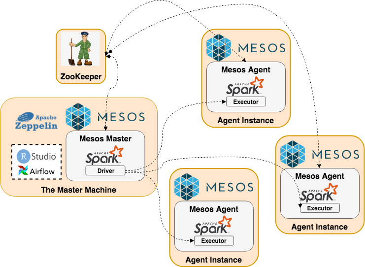

# Trinity
Trinity is a big data platform skeleton that aims to bridge the gaps among engineer, data scientist and business analyst.

## Deployment Architecture

## Setup The Master
Prerequisite: `python` is installed on The Master and there is a `ZooKeeper` standing by with IP=[zk_ip];

Pack Spark executor package for Mesos agents

    python pack_spark_executor.py

Build Docker image trinity_base

    docker build --rm -f Dockerfile.base -t trinity_base:latest .
    
Build Docker image trinity_nginx
    
    docker build --rm -f Dockerfile.nginx -t trinity_nginx:latest .

Build Docker image trinity_zeppelin

    docker build --rm -f Dockerfile.zeppelin -t trinity_zeppelin:latest .

Build Docker image trinity_rserver
    
    docker build --rm -f Dockerfile.rserver -t trinity_rserver:latest .
    
Docker run trinity_master

    docker run -d --net=host --name trinity_master trinity_base \
        mesos-master --port=5050 --quorum=1 --registry=in_memory \
                     --work_dir=/var/tmp/mesos --log_dir=/var/log/mesos \
                     --zk=zk://[zk_ip]:2181/trinity_dev
          
Docker run trinity_nginx

    docker run -d --net=host \
      --name trinity_nginx \
      trinity_nginx
      
Docker run trinity_zeppelin

    docker run -d --net=host \
      --name trinity_zeppelin \
      -e 'TRINITY_ENV=DEV' \
      -v "$(pwd)/docker_volume/zeppelin/notebook:/root/trinity/zeppelin/notebook" \
      trinity_zeppelin
      
Docker run trinity_rserver

    docker run -d --net=host \
      --name trinity_rserver \
      trinity_rserver
      
                    
## Setup Agent Cluster
Pack Spark executor package for Mesos agents

    python pack_spark_executor.py

Build Docker image trinity_base

    docker build --rm -f Dockerfile.base -t trinity_base:latest .

Docker run trinity_agent

    docker run -d --net=host --name trinity_agent \
        -v /var/run/docker/sock:/var/run/docker.sock \
        -v /cgroup:/cgroup \
        -v /sys:/sys \
        -v "$(which docker):/usr/local/bin/docker" \
        trinity_base \
        mesos-agent --port=5051 --no-systemd_enable_support --no-switch_user \
                    --work_dir=/var/tmp/mesos --log_dir=/var/log/mesos \
                    --master=zk://[zk_ip]:2181/trinity_dev

      
## Setup Zeppelin (on Master)
Follow link `http://[master_ip]:8080/#/interpreter` to open Zeppelin interpreter config page.
Make the following changes on interpreter `spark`,

    master                       mesos://zk://[zk_ip]:2181/trinity_dev
    spark.executor.uri           http://[master_ip]/spark-2.3.2-bin-hadoop2.7.tgz
    zeppelin.pyspark.python	     /root/trinity/conda/envs/trinity/bin/python
    spark.driver.memory          48g
    spark.executor.memory        48g
    spark.sql.shuffle.partitions 2160
    
To give Zeppelin a test drive, create a new note and try running the following code,

    %pyspark
    from example.myawesomelib.hello import greet
    spark.sparkContext.parallelize( [i for i in range(1,10000000)] ).map(lambda i: greet( str(i) ) ).take(100)[41]

The Mesos master UI should be available at `http://[master_ip]:5050`.

    
## Setup RStudio (on Master)
RStudio-server should be running at `http://[master_ip]:8787` with default user_name=password=bob.
To give sparklyr a test drive, follow the steps below,
1. In Rstudio-server, create file `spark_config.yml` with following content,

    default: 
    &nbsp;&nbsp;spark.executor.uri: "http://[master_ip]/spark-2.3.2-bin-hadoop2.7.tgz"
        
2. Run the following R code to create `sc`, spark context object,

    `library(sparklyr)` 
    `sc <- spark_connect(master='mesos://zk://[zk_ip]:2181/trinity_dev', spark_home='/share/spark', config=spark_config(file='spark_config.yml', use_default=TRUE) )`

## Update Your Code on Master
After submitting your latest code, to make the latest code available to the cluster, please run the following commands on The Master,

    git pull
    
    python pack_spark_executor.py
    
    docker build --rm -f Dockerfile.nginx -t trinity_nginx:latest .
    
    docker run -d --net=host \
      --name trinity_nginx \
      trinity_nginx
      
    docker build --rm -f Dockerfile.zeppelin -t trinity_zeppelin:latest .
    
    docker run -d --net=host \
      --name trinity_zeppelin \
      -e 'TRINITY_ENV=DEV' \
      -v "$(pwd)/docker_volume/zeppelin/notebook:/root/trinity/zeppelin/notebook" \
      trinity_zeppelin
      
    docker build --rm -f Dockerfile.rserver -t trinity_rserver:latest .

    docker run -d --net=host \
      --name trinity_rserver \
      trinity_rserver
